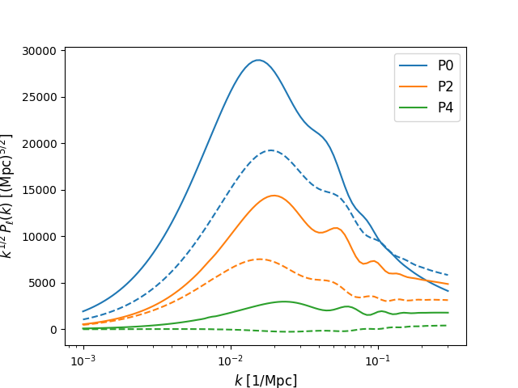
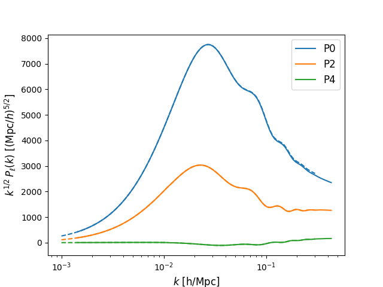

Examples
--------
Here we are going to show how to call each one of the different models that we
are able to emulate. Let's start with the simplest case, calling the emulator to
compute the real space galaxy power spectrum

The Real space emulator
=======================

The VDG_infty emulator
=======================

The EFT emulator
=======================

**Using Mpc units**

First, we need to import the main class as follow

::

  from comet import comet
  import numpy as np

We then create an instantiation of the emulator with the name of the model
we want to use.
Before being able to use the emulator for predictions of the multipoles,
we need to specify a number density (i.e., the inverse Poisson shot noise).
At the same time, we configure the emulator to output results either in units
of 1/Mpc (use_Mpc = True) or h/Mpc (use_Mpc = False) units.
All quantities that are not dimensionless are then assumed to be given in the
corresponding units.

Let's configure the emulator in Mpc units (which is the default, if `use_Mpc`
is not set explicitly), the number density is therefore in units of 1/Mpc^3

::

  EFT=comet(model="EFT", use_Mpc=True)
  EFT.define_nbar(nbar=1.32904e-4)

The functions returning the multipoles take generally three arguments:

1. The scales for which to compute the multipoles: if given as a number or numpy
array all specified multipoles will be computed for those scales, if given as
a list, the length must match the number of specified multipoles (ell) and the f
irst entry of the list is evaluated for the first multipole etc.

2. A parameter dictionary, specifying shape + RSD parameters, as well as bias
parameters.

3. The multipole number, i.e. ell = 0, 2, 4, or a list of multipole numbers.

::

  # Let's create a parameter dictionary
  params = {}

  # We always need to specify the shape parameter values, e.g.
  params['wc'] = 0.11544
  params['wb'] = 0.0222191
  params['ns'] = 0.9632

  # For predictions using the RSD parameter space we also need to specify values for the following four parameters, e.g.
  params['s12']      = 0.6
  params['alpha_lo'] = 1.1
  params['alpha_tr'] = 0.9
  params['f']        = 0.7

  # Finally, the bias parameters: any parameters from {b1, b2, g2, g21, c0, c2, c4, cnlo, N0, N20, N22} can be specified.
  # Parameters, which are not explicitly specified are automatically set to zero. As an example, let's just set b1 and b2:
  params['b1'] = 2.
  params['b2'] = -0.5

We can output at a single scale and single multipole number, e.g. for the quadrupole at k = 0.1 1/Mpc:

::

  >>> EFT.Pell(0.1, params, ell=2)
  {'ell2': array([22641.89764117])}

Or for various multipoles and multiple scales, in which case the output is a
list with the first entry corresponding to the first multipole specified in ell:

::

  >>> EFT.Pell(np.array([0.1,0.2,0.3]), params, ell=[0,2,4])
  {'ell0': array([31055.0916122 , 12361.60453026,  7524.37408667]), 'ell2': array([22641.89762504, 11914.05005836,  8891.37228123]), 'ell4': array([5904.2804531 , 3968.57823775, 3261.60821848])}

Or at different scales for different multipoles (providing a list of numbers or numpy arrays):

::

  >>> EFT.Pell([np.array([0.1,0.2]),0.3], params, ell=[0,4])
  {'ell0': array([31055.0916122 , 12361.60453026]), 'ell4': array([3261.60821848])}

Let's generate two different sets of predicitons for different parameter values and plot the results:

::

  # Define range of scales (remember: in 1/Mpc)
  k_Mpc = np.logspace(-3,np.log10(0.3),100)

  # get multipoles (in Mpc^3)
  Pell_Mpc_1 = EFT.Pell(k_Mpc, params, ell=[0,2,4])

  # Now, let's add/change some parameter values and obtain a second set of predictions
  params['alpha_tr'] = 1.2
  params['g2']       = -0.3
  params['c0']       = -4.
  params['cnlo']     = 6.
  params['N0']       = 0.6
  Pell_Mpc_2 = EFT.Pell(k_Mpc, params, ell=[0,2,4])

  # Plot the results!
  f = plt.figure()
  ax = f.add_subplot(111)

  ax.semilogx(k_Mpc, k_Mpc**0.5*Pell_Mpc_1['ell0'],c='C0',ls='-',label='P0')
  ax.semilogx(k_Mpc, k_Mpc**0.5*Pell_Mpc_2['ell0'],c='C0',ls='--')

  ax.semilogx(k_Mpc, k_Mpc**0.5*Pell_Mpc_1['ell2'],c='C1',ls='-',label='P2')
  ax.semilogx(k_Mpc, k_Mpc**0.5*Pell_Mpc_2['ell2'],c='C1',ls='--')

  ax.semilogx(k_Mpc, k_Mpc**0.5*Pell_Mpc_1['ell4'],c='C2',ls='-',label='P4')
  ax.semilogx(k_Mpc, k_Mpc**0.5*Pell_Mpc_2['ell4'],c='C2',ls='--')

  ax.set_xlabel('$k$ [1/Mpc]',fontsize=12)
  ax.set_ylabel(r'$k^{1/2}\,P_{\ell}(k)$ [$(\mathrm{Mpc})^{5/2}$]',fontsize=12)
  ax.legend(fontsize=12)

**Using Mpc/h units**

Now we switch to Mpc/h units, by calling define_units again and providing
the number density in units of (h/Mpc)^3:

::

  EFT.define_units(use_Mpc=False)
  EFT.define_nbar(nbar=3.95898e-4)

When computing the multipoles using the :math:`\sigma_{12}`​ parameter space we
now additionally need to specify a fiducial value for the Hubble rate. This is
required to convert the native emulator output from Mpc to Mpc/h units. So
let's add this to the parameter dictionary:

::

  params['h'] = 0.695

Now, we can compute the multipoles for the same range of scales, but in Mpc/h
units:

::

  k_hMpc = np.logspace(-3,np.log10(0.3),100)
  Pell_hMpc_2 = EFT.Pell(k_hMpc,params,ell=[0,2,4])

After scaling k_Mpc and Pell_Mpc_2 from above the results should be not
identical but quite close (apart from a different overall range of scales).
Let's check this is really the case:

::

  f = plt.figure()
  ax = f.add_subplot(111)

  ax.semilogx(k_Mpc/params['h'], (k_Mpc/params['h'])**0.5*Pell_Mpc_2['ell0']*params['h']**3,c='C0',ls='-',label='P0')
  ax.semilogx(k_hMpc, k_hMpc**0.5*Pell_hMpc_2['ell0'],c='C0',ls='--')

  ax.semilogx(k_Mpc/params['h'], (k_Mpc/params['h'])**0.5*Pell_Mpc_2['ell2']*params['h']**3,c='C1',ls='-',label='P2')
  ax.semilogx(k_hMpc, k_hMpc**0.5*Pell_hMpc_2['ell2'],c='C1',ls='--')

  ax.semilogx(k_Mpc/params['h'], (k_Mpc/params['h'])**0.5*Pell_Mpc_2['ell4']*params['h']**3,c='C2',ls='-',label='P4')
  ax.semilogx(k_hMpc, k_hMpc**0.5*Pell_hMpc_2['ell4'],c='C2',ls='--')

  ax.set_xlabel('$k$ [h/Mpc]',fontsize=12)
  ax.set_ylabel(r'$k^{1/2}\,P_{\ell}(k)$ [$(\mathrm{Mpc}/h)^{5/2}$]',fontsize=12)
  ax.legend(fontsize=12)

